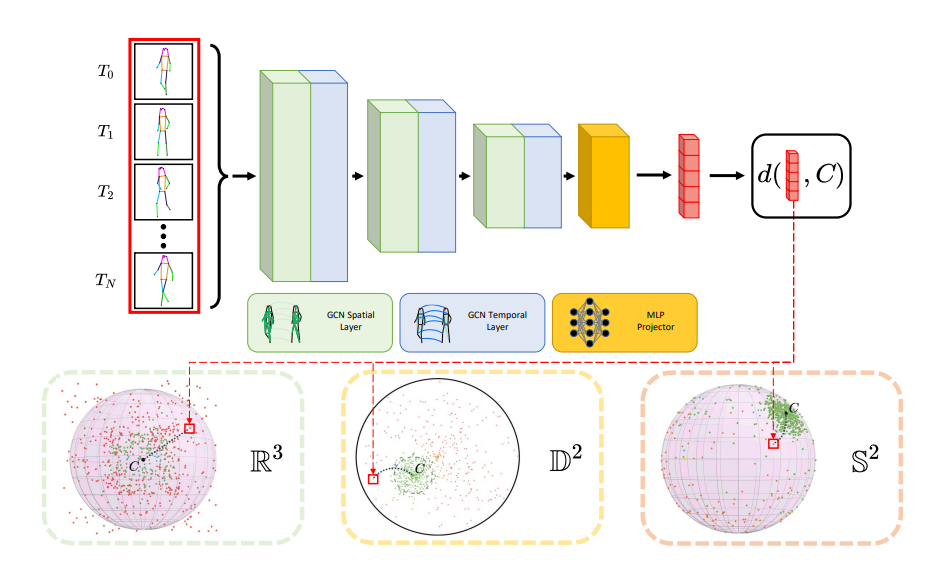

# Contracting Skeletal Kinematics for Human-Related Video Anomaly Detection
_Alessandro Flaborea*, Guido D'Amely*, Stefano D'Arrigo*, Marco Aurelio Sterpa, Alessio Sampieri, Fabio Galasso_


[](https://paperswithcode.com/sota/video-anomaly-detection-on-hr-ubnormal?p=contracting-skeletal-kinematic-embeddings-for)

[](https://paperswithcode.com/sota/anomaly-detection-on-ubnormal?p=contracting-skeletal-kinematic-embeddings-for)

[](https://paperswithcode.com/sota/video-anomaly-detection-on-hr-avenue?p=contracting-skeletal-kinematic-embeddings-for)

[](https://paperswithcode.com/sota/video-anomaly-detection-on-hr-shanghaitech?p=contracting-skeletal-kinematic-embeddings-for)

<p align="center">
    <a href="https://pytorch.org/get-started/locally/"></a>
    <a href="https://wandb.ai/site"></a>

</p>


The official PyTorch implementation of the paper [**Contracting Skeletal Kinematics for Human-Related Video Anomaly Detection**](https://www.sciencedirect.com/science/article/pii/S0031320324005685), published in the Pattern Recognition journal.

<!-- Visit our [**webpage**](https://www.pinlab.org/coskad) for more details. -->



## Content
```
.
├── assets
│   └── model.png
├── config
│   ├── Avenue
│   │   └── encoder.yaml
│   ├── STC
│   │   ├── euclidean_encoder.yaml
│   │   └── hyperbolic_encoder.yaml
│   └── UBnormal
│       ├── euclidean_autoencoder.yaml
│       ├── euclidean_encoder.yaml
│       ├── hyperbolic_encoder.yaml
│       └── spherical_vae.yaml
├── environment.yml
├── eval_COSKAD.py
├── models
│   ├── common
│   │   ├── alternative_components.py
│   │   ├── components.py
│   ├── euclidean_autoencoder.py
│   ├── euclidean_encoder_dynamicCenter.py
│   ├── euclidean_encoder_staticCenter.py
│   ├── gcae
│   │   ├── gcn.py
│   │   ├── learnable_gcn.py
│   │   ├── stgcn.py
│   │   └── stsgcn.py
│   ├── hyperbolic_encoder.py
│   ├── spherical_vae.py
│   ├── stsae
│   │   └── stsae_hidden_hypersphere.py
│   ├── stse
│   │   └── stse_hidden_hypersphere.py
│   └── stsve
│       └── stsve_hidden_hypersphere.py
├── README.md
├── train_COSKAD.py
└── utils
    ├── argparser.py
    ├── data.py
    ├── dataset.py
    ├── dataset_utils.py
    ├── eval_utils.py
    ├── get_robust_data.py
    ├── hyperbolic.py
    ├── hyper_math.py
    ├── __init__.py
    ├── model_utils.py
    ├── pose_dataset_mp.py
    ├── preprocessing.py
    └── tools.py

```

## Setup
### Environment
```
conda env create -f environment.yaml
conda activate coskad
```

### Datasets
Please take a look at the [MoCoDAD](https://github.com/aleflabo/MoCoDAD) repo for more details.

### **Training** 

To train COSKAD, you have to select one of the different model's option presented. 
In each config file is present a section called "Model's configuration" in which the flags enable and disable different features of COSKAD:

1. use_decoder: False   if use_decoder=True, the autoencoder architecture is used (usable only in the euclidean space)
2. use_vae: False   if use_vae=True, the spherical space is used
3. hyperbolic: True     if hyperbolic=True, the hyperbolic space is used, else the euclidean space is enabled
4. static_center: False     if static_center=False, the center of the hypersphere is not updated every epoch

Update the args 'data_dir', 'test_path', 'dataset_path_to_robust' with the path where you stored the datasets.  

To train COSKAD:
```
python train_COSKAD.py --config config/[Avenue/UBnormal/STC]/{config_name}.yaml
```


### Once trained, you can run the **Evaluation**

The training config is saved the associated experiment directory (/args.exp_dir/args.dataset_choice/args.dir_name). 
In order to evaluate the model on the test set, you need to change the following parameters in the config:

- split: 'Test'
- validation: 'False'
- load_ckpt: 'path_to_the_saved_ckpt'

Test COSKAD
```
python eval_COSKAD.py --config /args.exp_dir/args.dataset_choice/args.dir_name/config.yaml
```
additional flag you can use:
- use_hr: False -> just for test. Use the entire version of the dataset or the Human-Related one.


## Citation
```
@article{flaborea2024coskad,
  title={Contracting Skeletal Kinematics for Human-Related Video Anomaly Detection},
  author={Flaborea, Alessandro and D'Amely di Melendugno, Guido Maria and D'Arrigo, Stefano and Sterpa, Marco Aurelio and Sampieri, Alessio and Galasso, Fabio},
  journal={Pattern Recognition},
  year={2024},
  publisher={Elsevier}
}
```

